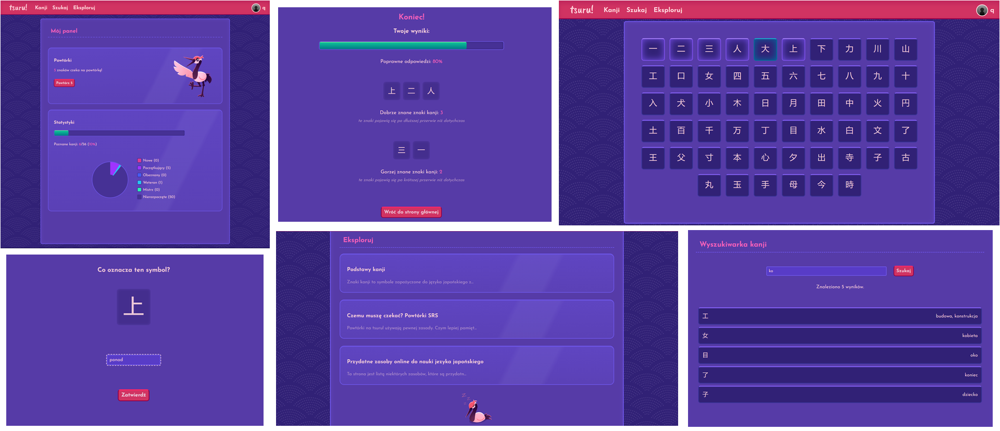

> [!NOTE]
> ### 🎓 This is a student project which won't be further updated.
> > **Finished:** `06.2023`
>
> This repository is read-only and works as an archive for this project.
>
> Despite this, downloading the files and running the application is encouraged. I would be happy if this project ended up as help or inspiration.

# <picture><source media="(prefers-color-scheme: dark)" srcset="images/logo-white.png"><source media="(prefers-color-scheme: light)" srcset="images/logo-black.png"></picture>

A website for learning kanji, with a review system, kanji dictionary and more. The website's interface is in Polish. Made from scratch using PHP.

Inspired by language learning services like [Duolingo](https://www.duolingo.com/) and [WaniKani](https://www.wanikani.com/). The website's mascot is a red-crowned crane, which reflects the site's name, which means "crane" in Japanese.

 

 
<i>landing page</i>

### Features:
- interactive spaced-repetition review system
- account system with 10 profile picture options
- statistics panel with details on % of kanji learned and their level
- kanji dictionary with current progress if logged in
- kanji search
- a few short articles centered around the Japanese language

 

 
<i>screenshots</i>

 

 

## 🛠 Setup

1. Clone the repository.

2. In your SQL database management system of choice, create a database by importing the `kanjiwebsite.sql` file. This file includes 35 kanji and some test accounts.
   > A test account for general testing is `q` for both username and password.

3. In `php/connect.php`, change the connection variables to match your database.

4. With your database accessible, run the `index.php` file.

 

## 🔗 References

Most impactful tutorials and tools used while creating the project.

- [Josefin Sans](https://fonts.google.com/specimen/Josefin+Sans) and [Caveat Brush](https://fonts.google.com/specimen/Caveat+Brush) - Google Fonts used for the interface and logo respectively.
- [IbisPaintX](https://ibispaint.com/about.jsp) - app used to create the artworks and source of the background pattern.
- [Favicon.io](https://favicon.io/emoji-favicons/) - used to generate the favicon from the 🏵️ emoji.

---

- <kbd>ictdemy.com</kbd> [Putting web pages together using PHP](https://www.ictdemy.com/php/basics/tutorial-putting-web-pages-together-using-php) - taught the approach for reusing php files.
- <kbd>YouTube Tutorial</kbd> [Connect to MySQL with PHP in XAMPP](https://www.youtube.com/watch?v=ueWpNe0PG34) - guided through connecting to a database via PHP.
- <kbd>Stack Overflow</kbd> [How to call a PHP function on the click of a button](https://stackoverflow.com/questions/20738329/how-to-call-a-php-function-on-the-click-of-a-button) and [How to call a php function from ajax?](https://stackoverflow.com/questions/39341901/how-to-call-a-php-function-from-ajax) - helped a lot: it was my first time using AJAX.
- <kbd>Stack Overflow</kbd> [How to select row using bind_param php mysqli?](https://stackoverflow.com/questions/49355934/how-to-select-row-using-bind-param-php-mysqli) - helped understand how to read data from the database.

 
