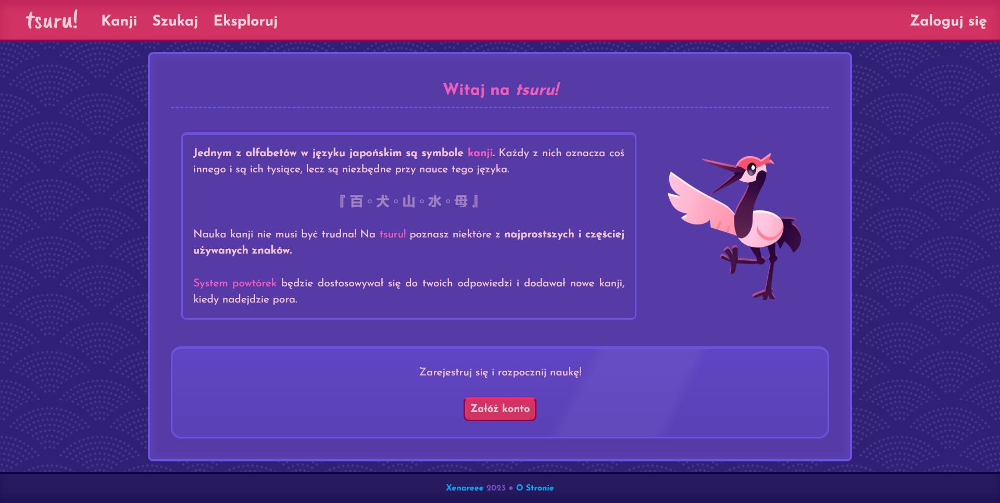

> [!NOTE]
> ### 🎓 This is a student project which won't be further updated.
> > **Finished:** `06.2023`
>
> This repository is read-only and works as an archive for this project.
>
> Despite this, downloading the files and running the application is encouraged. I would be happy if this project ended up as help or inspiration.

# <picture><source media="(prefers-color-scheme: dark)" srcset="images/logo-white.png"><source media="(prefers-color-scheme: light)" srcset="images/logo-black.png"></picture>

A website for learning kanji, with a revision system, kanji dictionary and more. The website is written in Polish.

 

 
<i>landing page</i>

 

`work in progress`

 

## 🛠 Setup

1. Clone the repository.

2. In your SQL database management system of choice, create a database by importing the `kanjiwebsite.sql` file. This file includes 35 kanji and some test accounts.
   > A test account for general testing is `q` for both username and password.

3. In `php/connect.php`, change the connection variables to match your database.

4. With your database accessible, run the `index.php` file.

 

## 🔗 References

Most impactful tutorials and tools used while creating the project.

`work in progress`

 
